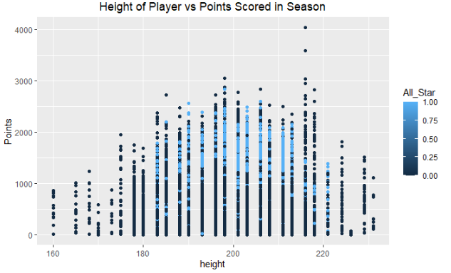
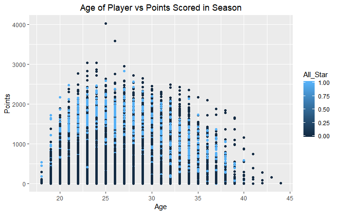
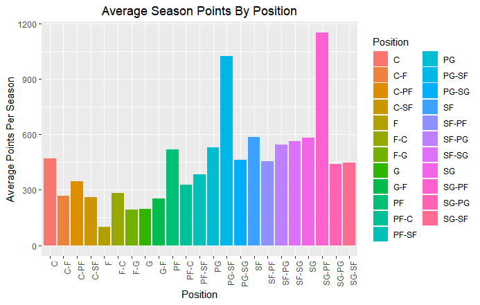
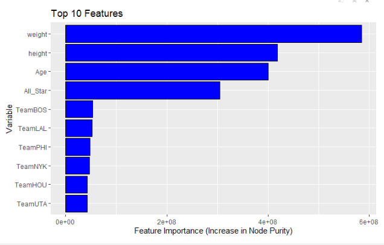

# NBA_Scoring_Analysis

## Introduction

Sports analytics is a growing industry, as team owners, coaches, and analysts are starting to recognize the value that data-driven analyses can provide. When used correctly, this information can optimize the team's performance and give them insights into previously untapped areas of the game. This knowledge can be useful to players, coaches, and administration staff to make better decisions on behalf of the team. When data is properly utilized to gather a deeper understanding of the game, the level at which basketball is played and enjoyed can both be improved.

I used regression models to predict the number of points scored in a specific season for a given NBA player.  To do this I am going to be training the regression models on the merged data set formed by combining select fields from each of the four datasets that we chose (Players.csv, Seasons_Stats.csv, player_data.csv, NBA All Star Games.xlsx). These data sets offer player demographics, season statistics, as well as all-star status of each player.

This is very valuable information to a team manager/owner and allows them to project how well a player will perform during an upcoming season based on their current demographics, playing history, and accolades.  This information would also be useful for player trades and determining the value of a player based on how many points they are expected to score in a season.  Points scored is a key performance metric that basketball fans care about the most, so being able to accurately predict how well a player is going to perform in a season would be very exciting. I am also very interested into what features of the player have the greatest impact on the points they will score in a season.  I hypothesized that All-Star status and position will have the most affect on the response variable, but I wondered if there are any high impact hidden features.

## Data Description

I used datasets found on Kaggle.com and data.world for this analysis. The datasets contained information about players from the National Basketball Association (NBA). The different datasets used in the analysis are as follows:

* *Season Stats*: 24,700 observations of aggregate season statistics for every player and season since 1950
* *Player Data*: 5,000 observations of nominal data about each player since 1950, including the specific years spent in the NBA, college attended, height, and weight
* *NBA All Star Data*: A collection of 440 players selected to the NBA All-Star Game every year from 2000-2016; includes nominal information such as draft status, team, and nationality

## Data Wrangling

To wrangle the required data for the analysis I used MySQL Workbench to create a new table schema that will house all the data fields to be used in the analysis phase and omits the unnecessary fields to eliminate noise and allow the algorithms to efficiently draw correlations from the data.  The features used in the final schema were Player_Name, Points_Scored, Team, Height, Weight, Position, College, Age, and All_Star.  Player_Name was the primary key because that is what uniquely identifies each NBA player in the datasets (first and last name), Age is a calculated field by subtracting their year of birth from their start year playing in the NBA, and All_Star is a Boolean variable that is true if they were ever part of an All-Star Team during their career and false otherwise.  The rest of the feature values were pulled directly from one of the source datasets.  To transform the data into a usable format for the regression models, the null values need to be taken care of, the categorical features need to be imputed, and for Euclidean distance algorithms, the features needed to be scaled/normalized. 

This data was then imported into R via SQL queries and the necessary data preprocessing was performed. Missing values were imputed or dropped from the dataset depending on the field, categorical variables were encoded, and some variables were transformed to get them into a usable format for input in to the models.

## Exploratory Analysis

From these plots we can see that most of the all-stars are in the upper-middle height range from about 185 cm - 220 cm. The low end and very high end of the height range have extremely low numbers of all-stars. The number of points scored follows a similar pattern, with the most average season points being scored by players in the upper-middle height range, with dips in points near both height extremes.

The age of players also plays an important role in the number of points scored by players as well as their all-star status. The age range of 21-39 seems to produce the most all-stars. The optimal player age for scoring the most average season points appears to be around the 23-29 age range. The points scored starts low and peaks in this 23-29 range, and then slowly decreases from there on out as the player gets older.

It appears that the SG-PF position and PG-SF positions score the most points on average per season. This makes sense because they are attacking positions that have a lot of time on the ball and are taking the most shots.

## Modeling

## Results

The models tried and their respective root mean squared error (RMSE) on the test set is shown in the table below: 

The best performing model was the Random Forest with 50 trees, which got a RMSE of 390.7, which is decent (average season points is around 600). Ensemble methods are powerful for regression, and the Random Forest model was the best option for the final prediction model. This model would prove to be effective for benchmarking the number of points a new player to the league will score in a season. This model along with the interpretability of the regression coefficients and feature importances values can prove to be valuable to coaches and team managers alike. 

This plot shows the feature importance values (in terms of increase in node purity) for the top 10 most important variables from the optimal model. It looks that weight, height, age, and all-star status are all very predictive of the amount of points a given player will score in a season. THe teams that the players are on are still predicitive of season points, but not nearly to the scale of the former variables mentioned. It seems that physical build and age of players is more important than I would have guessed and actually is more important than all-star status as to scoring ability of the player. This somewhat surprised me, as I would think that all-star players would be top performers and that they would be able to overpower this phyiscal traits, but it also could be a problem with imbalanced data. There are a lot less all-star players than non all-star players in the dataset, which could have caused this feature to become undervalued in the model for predicting season points. It makes sense that the team the player is on has a small role in the number of points a player scores. If a given player is on the court with extremely talented or untalented teammates, it will affect the players ability to get the ball in shooting positions and therefore affect the points scored throughout the season.
